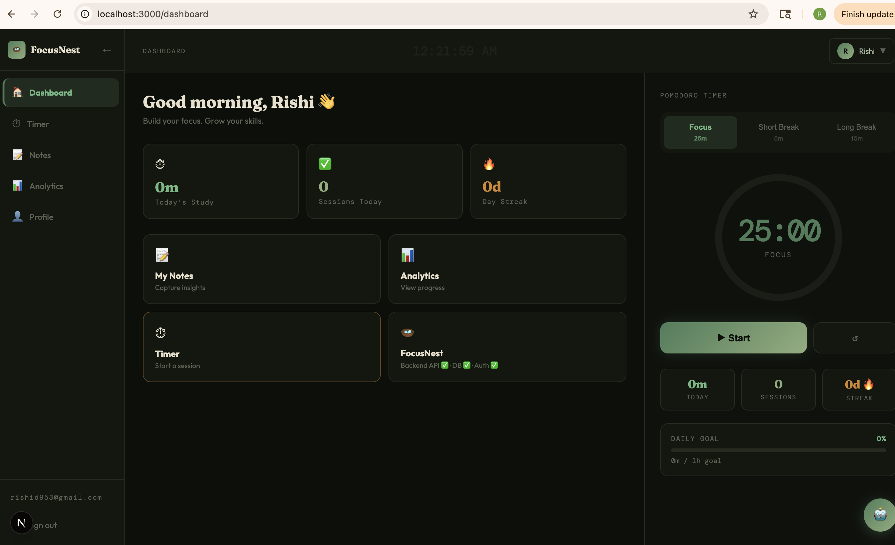
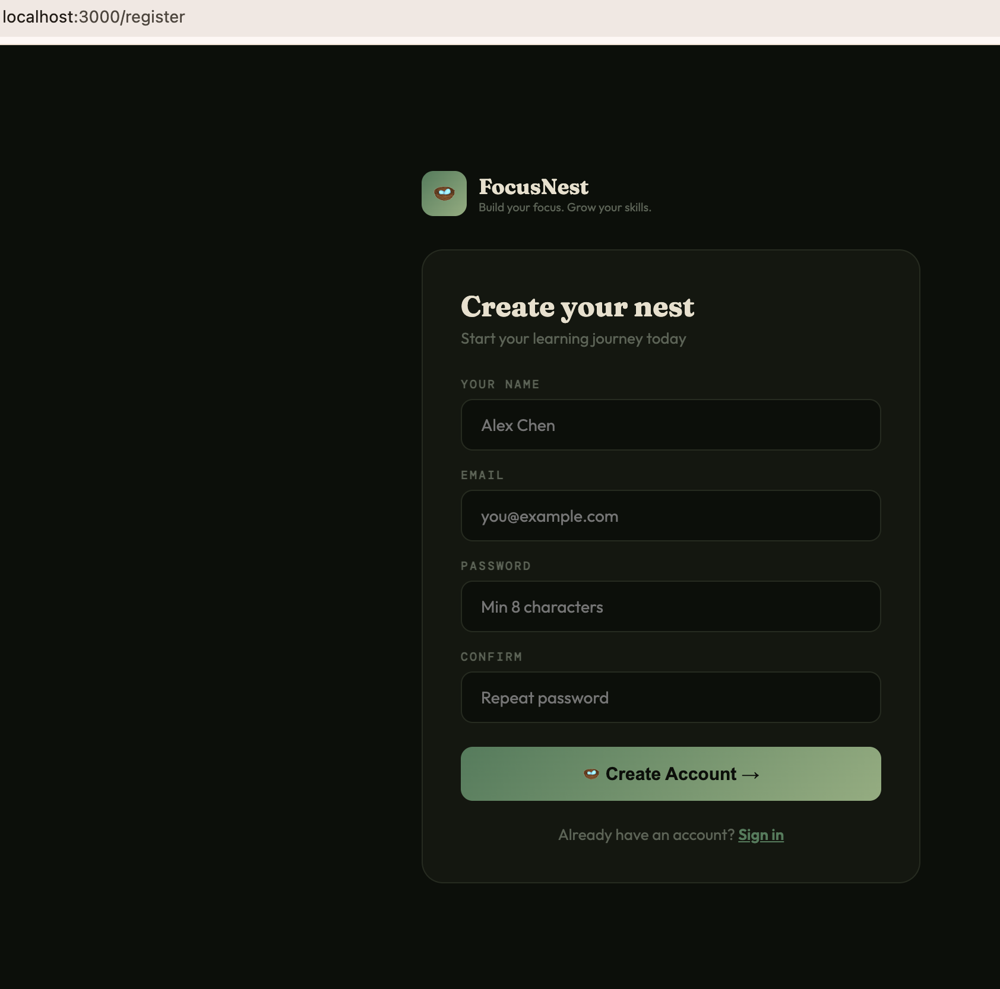
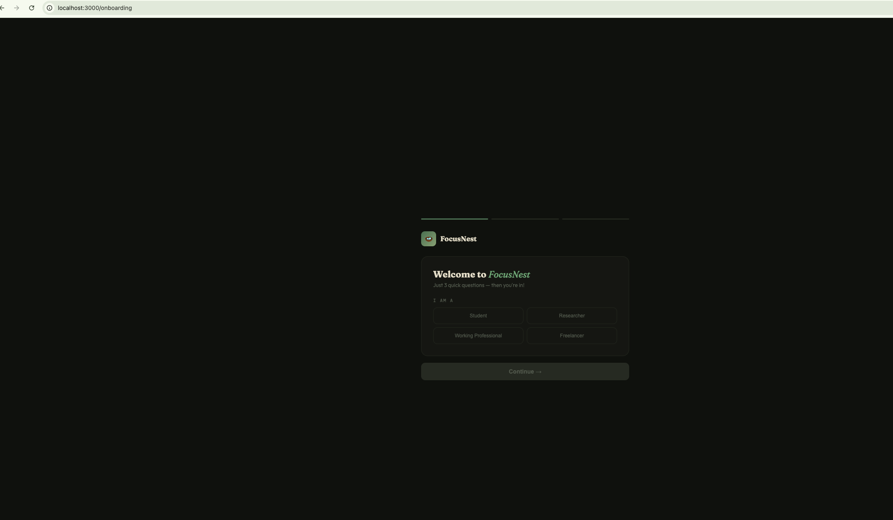
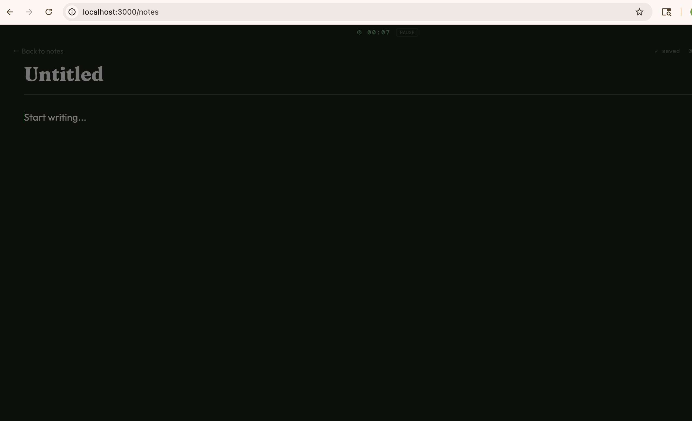
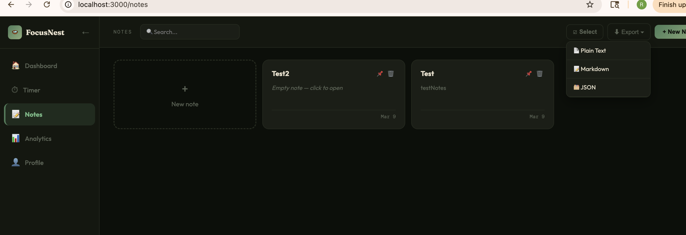
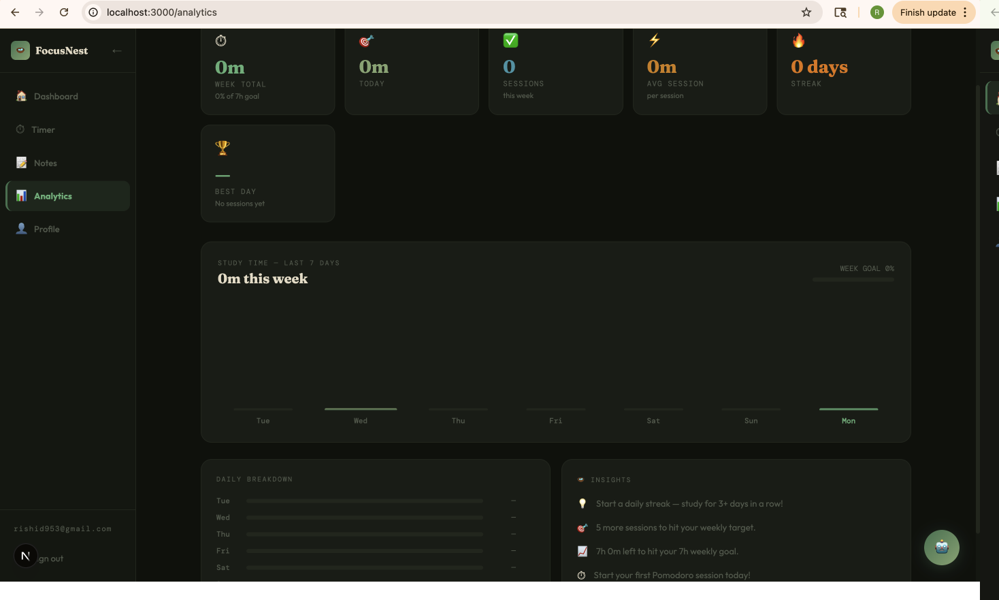
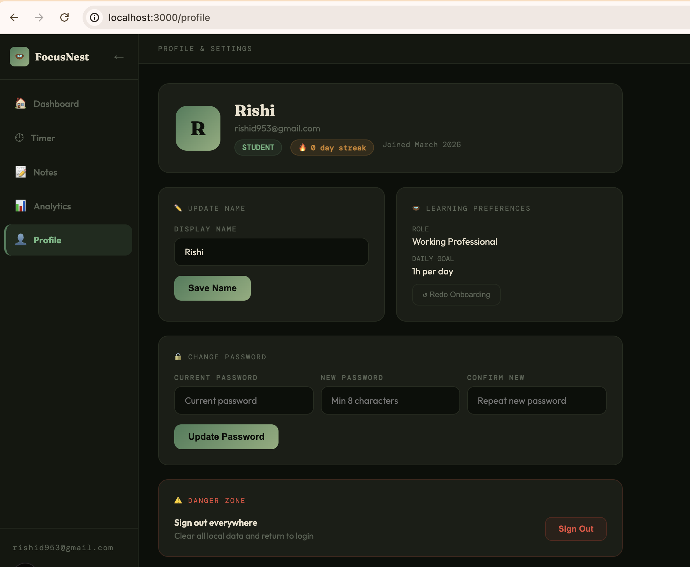
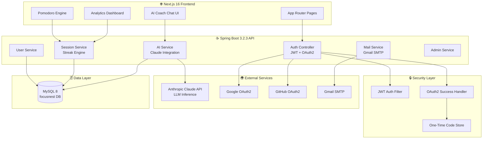
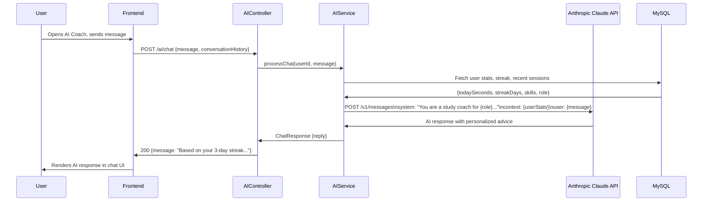
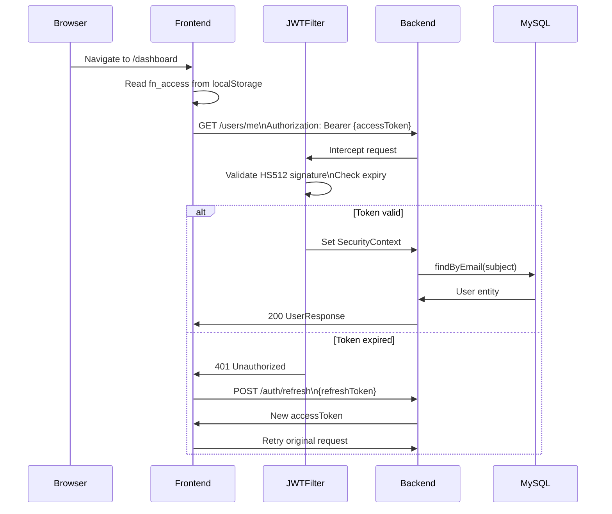

# 🪺 FocusNest — AI-Powered Productivity Platform

> An intelligent full-stack productivity platform that leverages LLM integration, OAuth2 multi-provider authentication, and real-time analytics to help students, researchers, and professionals maximize their learning efficiency.

[](https://openjdk.org/)
[](https://spring.io/projects/spring-boot)
[](https://nextjs.org/)
[](https://www.mysql.com/)
[](https://jwt.io/)
[](https://oauth.net/2/)
[](https://www.anthropic.com/)

---

## 📸 Screenshots

### 🏠 Dashboard

> Personalized greeting, real-time Pomodoro timer, study stats, streak tracking and hover-reveal clock

### 🚀 Sign Up

> Clean registration flow with email/password or OAuth2

### 🪺 Onboarding

> 3-step personalized onboarding — role, skills, and daily goal selection

### 📝 Notes

> Note management with search, pin, and export (Plain Text, Markdown, JSON)

### ✍️ Distraction-Free Editor

> Minimal writing experience with auto-save and built-in focus timer

### 📊 Analytics

> Weekly study breakdown, daily insights, streak trends and goal tracking

### 👤 Profile & Settings

> Role management, learning preferences, password update and account settings

---

## 🤖 AI & Intelligence Features

> **This is where FocusNest stands apart.**

### LLM Integration (Anthropic Claude)
- **AI Study Coach** — Conversational AI assistant powered by Claude Sonnet that analyzes user behavior and generates personalized study plans
- **Context-Aware Recommendations** — The AI coach receives user session history, streak data, and skill preferences as context to generate hyper-personalized advice
- **Real-Time Chat Interface** — Streaming LLM responses with multi-turn conversation memory within a session

### Intelligent Analytics
- **Behavioral Pattern Detection** — Tracks focus duration, break patterns, and peak productivity windows
- **Streak Intelligence** — Smart streak calculation that accounts for timezone and daily goal thresholds
- **Session Scoring** — Pomodoro sessions are scored and fed back to the AI context for smarter recommendations

---

## ✨ Full Feature Set

| Feature | Description |
|---|---|
| 🔐 Multi-Provider Auth | Email/password + Google OAuth2 + GitHub OAuth2 |
| 🤖 AI Study Coach | LLM-powered personalized recommendations via Claude API |
| ⏱ Pomodoro Engine | Focus/break cycle with configurable intervals and streak tracking |
| 📝 Smart Notes | Distraction-free editor with auto-save and export (Plain Text, Markdown, JSON) |
| 📊 Learning Analytics | Daily/weekly study time, session count, streak trends |
| 🔑 Secure Password Reset | Time-bound token reset via Gmail SMTP |
| 👤 User Onboarding | Multi-step role and skill preference collection synced to DB |
| 🛡 Admin Dashboard | User management, flagging, and platform analytics |
| 🔄 JWT Refresh Flow | Silent token rotation with 15min access / 7day refresh window |
| 🔒 OAuth Code Exchange | One-time code pattern — JWT never exposed in URL or browser history |

---

## 🏗 System Architecture



---

## 🔄 Authentication Flow

```mermaid
flowchart TD
    A([User visits FocusNest]) --> B{Login method}

    B -- Email/Password --> C[POST /auth/login]
    C --> D{Valid credentials?}
    D -- No --> E[401 Unauthorized]
    D -- Yes --> F[Generate JWT pair]

    B -- Google/GitHub --> G[GET /oauth2/authorize]
    G --> H[Provider consent screen]
    H --> I[OAuth2 callback]
    I --> J[OAuth2SuccessHandler]
    J --> K{User in DB?}
    K -- No --> L[(Create user record)]
    K -- Yes --> M[(Load user)]
    L --> N[Generate one-time code\n2 min TTL in-memory]
    M --> N
    N --> O[Redirect frontend\n?code=uuid]
    O --> P[POST /auth/token/exchange]
    P --> F

    F --> Q[Access Token 15min\nRefresh Token 7days]
    Q --> R{onboarding_done?}
    R -- false --> S[/onboarding]
    R -- true --> T[/dashboard]

    S --> U[Complete 3-step onboarding]
    U --> V[PATCH /users/me/onboarding]
    V --> W[(Set onboarding_done = true)]
    W --> T
```

---

## 🤖 AI Coach Flow



---

## ⏱ Pomodoro & Streak Engine

```mermaid
flowchart TD
    A([User starts session]) --> B[25 min focus timer]
    B --> C{Timer complete?}
    C -- No --> B
    C -- Yes --> D[POST /sessions\n{durationSeconds, type}]
    D --> E[(Save to study_sessions)]
    E --> F[Streak calculation]
    F --> G{Last study date\n= today?}
    G -- Yes --> H[Streak maintained]
    G -- No --> I{Last study date\n= yesterday?}
    I -- Yes --> J[Streak + 1]
    I -- No --> K[Streak reset to 1]
    H --> L[Update user stats]
    J --> L
    K --> L
    L --> M{Session count\nthis round}
    M -- Less than 4 --> N[5 min short break]
    M -- 4th session --> O[15 min long break]
    N --> A
    O --> A
    L --> P[Feed data to AI context\non next coach query]
```

---

## 🔑 JWT Security Flow



---

## 🚀 Getting Started

### Prerequisites

- Java 25+
- Node.js 18+
- MySQL 8
- Maven 3.8+

### 1. Clone

```bash
git clone https://github.com/rishikanthjavadev-stack/focusnest.git
cd focusnest
```

### 2. MySQL Setup

```sql
CREATE DATABASE focusnest;
CREATE USER 'focusnest_dev'@'localhost' IDENTIFIED BY 'your-password';
GRANT ALL PRIVILEGES ON focusnest.* TO 'focusnest_dev'@'localhost';
FLUSH PRIVILEGES;
```

### 3. Configure Secrets

Create `focusnest-backend/src/main/resources/application-local.yml` (gitignored):

```yaml
spring:
  security:
    oauth2:
      client:
        registration:
          google:
            client-id: YOUR_GOOGLE_CLIENT_ID
            client-secret: YOUR_GOOGLE_CLIENT_SECRET
          github:
            client-id: YOUR_GITHUB_CLIENT_ID
            client-secret: YOUR_GITHUB_CLIENT_SECRET
  mail:
    host: smtp.gmail.com
    port: 587
    username: YOUR_GMAIL
    password: YOUR_APP_PASSWORD
    properties:
      mail:
        smtp:
          auth: true
          starttls:
            enable: true
```

### 4. Run Backend

```bash
cd focusnest-backend
mvn spring-boot:run -Dspring-boot.run.profiles=local
# Runs on http://localhost:8080/api
```

### 5. Run Frontend

```bash
cd focusnest-frontend
npm install && npm run dev
# Runs on http://localhost:3000
```

---

## 📁 Project Structure

```
focusnest/
├── focusnest-backend/
│   └── src/main/java/com/focusnest/
│       ├── controller/       # AuthController, UserController, AIController,
│       │                     # SessionController, NoteController, AdminController
│       ├── service/          # AuthService, AIService, SessionService,
│       │                     # PasswordResetService, OAuthTokenStore
│       ├── model/            # User, StudySession, Note (JPA entities)
│       ├── repository/       # Spring Data JPA repositories
│       ├── security/         # JwtAuthFilter, JwtTokenProvider, OAuth2SuccessHandler
│       ├── config/           # SecurityConfig, CorsConfig, MailConfig
│       └── dto/              # Request/Response DTOs
└── focusnest-frontend/
    └── src/
        ├── app/              # dashboard, timer, notes, analytics,
        │                     # profile, onboarding, admin, auth pages
        ├── components/       # PomodoroTimer, AppLayout, AICoach
        └── services/         # Axios API client with interceptors
```

---

## 🔌 REST API Reference

| Method | Endpoint | Auth | Description |
|---|---|---|---|
| POST | `/auth/register` | ❌ | Register with email/password |
| POST | `/auth/login` | ❌ | Login, returns JWT pair |
| POST | `/auth/refresh` | ❌ | Rotate access token |
| POST | `/auth/token/exchange` | ❌ | Exchange OAuth one-time code for JWT |
| POST | `/auth/forgot-password` | ❌ | Trigger reset email |
| POST | `/auth/reset-password` | ❌ | Reset with token |
| GET | `/users/me` | ✅ JWT | Get current user profile |
| PUT | `/users/me` | ✅ JWT | Update name/password |
| PATCH | `/users/me/onboarding` | ✅ JWT | Mark onboarding complete |
| GET | `/sessions/stats` | ✅ JWT | Today's stats + streak |
| POST | `/sessions` | ✅ JWT | Save completed Pomodoro session |
| GET | `/notes` | ✅ JWT | List user notes |
| POST | `/notes` | ✅ JWT | Create note |
| POST | `/ai/chat` | ✅ JWT | Send message to AI coach |
| GET | `/admin/users` | 🛡 Admin | List all users |

---

## 🧠 What This Project Demonstrates

| Skill | Implementation |
|---|---|
| **LLM Integration** | Anthropic Claude API with user context injection |
| **Prompt Engineering** | System prompts with dynamic user context for personalization |
| **OAuth2 Multi-Provider** | Google + GitHub with custom success handler |
| **Secure Token Exchange** | One-time code pattern, JWT never in URL |
| **JWT Architecture** | HS512 signing, access/refresh rotation, filter chain |
| **Spring Security** | Custom filter chain, stateless session, CORS |
| **JPA / ORM** | Entity relationships, custom JPQL queries, streak logic |
| **RESTful API Design** | Proper HTTP methods, status codes, DTO pattern |
| **Full Stack TypeScript** | Next.js App Router, Axios interceptors, localStorage auth |
| **Email Integration** | Gmail SMTP with Spring Mail, time-bound reset tokens |
| **Admin Systems** | Role-based access control, user flagging |

---

## 🔒 Security Highlights

- JWT signed with **HS512** — stronger than the common HS256
- Access tokens expire in **15 minutes** — minimizes breach window
- OAuth2 tokens use **one-time code exchange** — never stored in URL, server logs, or browser history
- Passwords hashed with **BCrypt** adaptive cost factor
- Reset tokens are **time-bound** (1 hour TTL) and single-use

---

## 🗺 Roadmap

- [ ] Deploy to AWS (ECS + RDS + CloudFront)
- [ ] RAG (Retrieval-Augmented Generation) for note-based AI Q&A
- [ ] Kafka event streaming for real-time session sync across devices
- [ ] WebSocket-based collaborative study rooms
- [ ] Mobile app (React Native)
- [ ] Fine-tuned study recommendation model

---

## 📄 License

MIT © 2025 FocusNest
